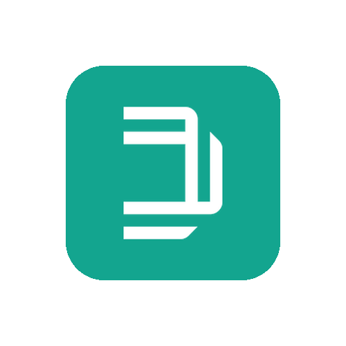

# Dragonfly / Intelcom

> **New in v0.3.6**

Follow Dragonfly (Netherlands, Australia) and Intelcom (Canada) parcels with their tracking number – no account needed. With delivery window (ETA), out for delivery, delivered, history in your language (when Dragonfly has it) and parcels you send yourself. For Canada the device is named Intelcom.

## At a glance

| | |
|---|---|
| Countries | 🇳🇱 🇦🇺 🇨🇦 Netherlands and Australia (Dragonfly), Canada (Intelcom) |
| Connect with | Tracking number |
| Device ID | `dragonfly` |
| Flow cards | 10 triggers · 6 conditions · 4 actions |

## Connect

1. Open Homey → **Devices** → **+** → **MyParcel** → **Dragonfly / Intelcom**.
2. Choose the **country**: Netherlands (Dragonfly), Australia (Dragonfly) or Canada (Intelcom).
3. Optionally enter **tracking numbers**, one per line (e.g. `INTLCMB2C000999999`). Add ` out` after a code for a parcel you send yourself.
4. Tap **Add device**. You can add codes later in the device settings or with a Flow.

## Settings

| Group | Setting | Explanation |
|---|---|---|
| Dragonfly / Intelcom Track & Trace | **Country** | (choices: Netherlands (Dragonfly), Australia (Dragonfly), Canada (Intelcom)) |
| Dragonfly / Intelcom Track & Trace | **Tracking numbers** | One tracking number per line. Add " out" after a number for a parcel you send yourself. |
| Dragonfly / Intelcom Track & Trace | **Show delivered parcels for (days)** | (default: 7) |

## Device values (capabilities)

Every value appears on the device in Homey. Not every field is filled for every parcel.

| ID | Type | Nederlands | English |
|---|---|---|---|
| `dragonfly_parcel_count` | number | Actieve pakketten | Active parcels |
| `dragonfly_status` | text | Status | Status |
| `dragonfly_tracking` | text | Trackingnummer | Tracking number |
| `dragonfly_sender` | text | Afzender | Sender |
| `dragonfly_delivery_date` | text | Bezorgdatum | Delivery date |
| `dragonfly_delivery_window` | text | Bezorgvenster | Delivery window |
| `dragonfly_next_delivery` | text | Volgende bezorging | Next delivery |
| `dragonfly_out_for_delivery_count` | number | Onderweg voor bezorging | Out for delivery |
| `dragonfly_delivered_count` | number | Recent bezorgd | Recently delivered |
| `dragonfly_outgoing_count` | number | Verzonden pakketten onderweg | Sent parcels underway |
| `dragonfly_last_event` | text | Laatste gebeurtenis | Last event |
| `myparcel_connection_status` | text | Verbindingsstatus | Connection status |
| `dragonfly_last_update` | text | Laatste update | Last update |

## Flow cards

### When… (triggers)

| ID | Nederlands | English |
|---|---|---|
| `dragonfly_new_package` | Nieuw Dragonfly-pakket | New Dragonfly parcel |
| `dragonfly_status_changed` | Status Dragonfly-pakket gewijzigd | Dragonfly parcel status changed |
| `dragonfly_package_event_changed` | Nieuwe Dragonfly-trackinggebeurtenis | New Dragonfly tracking event |
| `dragonfly_out_for_delivery` | Dragonfly-pakket onderweg voor bezorging | Dragonfly parcel out for delivery |
| `dragonfly_delivered` | Dragonfly-pakket bezorgd | Dragonfly parcel delivered |
| `dragonfly_package_problem` | Probleem of retour bij Dragonfly-pakket | Dragonfly parcel has a problem or is returning |
| `dragonfly_outgoing_status_changed` | Status van verzonden Dragonfly-pakket gewijzigd | Status of sent Dragonfly parcel changed |
| `dragonfly_outgoing_delivered` | Verzonden Dragonfly-pakket bezorgd | Sent Dragonfly parcel delivered |
| `dragonfly_delivery_window_changed` | Dragonfly-bezorgtijd gewijzigd | Dragonfly delivery time changed |
| `connection_status_changed` | Verbindingsstatus is gewijzigd | Connection status changed *(applies to all MyParcel devices)* |

### And… (conditions)

| ID | Nederlands | English | Arguments |
|---|---|---|---|
| `dragonfly_packages_underway` | Er zijn/zijn geen Dragonfly-pakketten onderweg | Dragonfly parcels are/are not underway | — |
| `dragonfly_out_for_delivery_now` | Er is een/geen Dragonfly-pakket onderweg voor bezorging | A Dragonfly parcel is/is not out for delivery | — |
| `dragonfly_any_status_is` | Een Dragonfly-pakket heeft/heeft niet status… | A Dragonfly parcel has/does not have status… | Status (Registered, In transit, Out for delivery, Ready for pickup, Delivered, Returning to sender, Problem, Not yet known at Dragonfly / Intelcom) |
| `dragonfly_parcel_is_delivered` | Dragonfly-pakket… is/is niet bezorgd | Dragonfly parcel… is/is not delivered | Tracking number |
| `dragonfly_is_tracking` | Dragonfly-pakket… wordt wel/niet gevolgd | Dragonfly parcel… is/is not being tracked | Tracking number |
| `dragonfly_outgoing_underway` | Er zijn/zijn geen verzonden Dragonfly-pakketten onderweg | Sent Dragonfly parcels are/are not underway | — |

### Then… (actions)

| ID | Nederlands | English | Arguments |
|---|---|---|---|
| `dragonfly_refresh` | Vernieuw Dragonfly | Refresh Dragonfly | — |
| `dragonfly_track_parcel` | Volg Dragonfly-pakket… | Track Dragonfly parcel… | Tracking number; Direction (Incoming, Outgoing (sent by me)) |
| `dragonfly_untrack_parcel` | Stop met volgen van Dragonfly-pakket… | Stop tracking Dragonfly parcel… | Tracking number |
| `dragonfly_remove_delivered` | Verwijder bezorgde Dragonfly-pakketten | Remove delivered Dragonfly parcels | — |

## Notable tokens

Tokens passed by this carrier's When cards (not every card has every token).

Show all 24 tokens

| Token | Type | Nederlands | English |
|---|---|---|---|
| `tracking` | text | Trackingnummer | Tracking number |
| `status` | text | Status | Status |
| `status_code` | text | Statuscode | Status code |
| `raw_status` | text | Dragonfly / Intelcom-statustekst | Dragonfly / Intelcom status text |
| `sender` | text | Afzender | Sender |
| `receiver` | text | Ontvanger | Recipient |
| `delivery_date` | text | Bezorgdatum | Delivery date |
| `delivery_window` | text | Bezorgvenster | Delivery window |
| `window_start` | text | Begin venster | Window start |
| `window_end` | text | Einde venster | Window end |
| `pickup_point` | text | Afhaalpunt | Pickup point |
| `last_event` | text | Laatste gebeurtenis | Last event |
| `last_event_time` | text | Tijd laatste gebeurtenis | Last event time |
| `delivered_at` | text | Bezorgd op | Delivered at |
| `direction` | text | Richting | Direction |
| `history` | text | Statusgeschiedenis | Status history |
| `url` | text | Trackinglink | Tracking link |
| `service` | text | Dienst | Service |
| `country` | text | Land | Country |
| `carrier` | text | Vervoerder | Carrier |
| `previous_status` | text | Vorige status | Previous status |
| `old_status_code` | text | Vorige statuscode | Previous status code |
| `old_event` | text | Vorige Dragonfly / Intelcom-statustekst | Previous Dragonfly / Intelcom status text |
| `old_delivery_window` | text | Vorig bezorgvenster | Previous delivery window |

## Limitations and tips

* No account link: only numbers you add (and pickup tasks for sent parcels) are followed.

[← All carriers](README.md) · [Flow cards](../flows.md) · [Flow tokens](../tokens.md) · [Troubleshooting](../troubleshooting.md) · [Homey App Store](https://homey.app/en-us/app/nl.lrvdlinden.MyParcel/MyParcel/test/) · [Homey Community](https://community.homey.app/t/app-pro-myparcel/159800)
