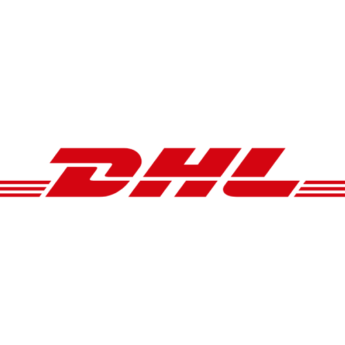

# Post & DHL Germany

**Region:** 🇩🇪 Germany

**Description:** Post & DHL, including letters

## Install and connect

In Homey open Devices → Add device → MyParcel, choose your carrier and follow its sign-in screen. Add a separate device for each carrier you use.

## Device data

* `dhl_de_parcel_count`
* `dhl_de_mail_count`
* `dhl_de_status`
* `dhl_de_next_delivery`
* `dhl_de_postnumber`
* `dhl_de_account_status`
* `dhl_de_mail_status`
* `dhl_de_last_update`

Available data depends on the carrier and shipment. Not every field is populated for every parcel.

[← Supported carriers](README.md) · [Homey App Store](https://homey.app/en-us/app/nl.lrvdlinden.MyParcel/MyParcel/test/) · [Homey Community](https://community.homey.app/t/app-pro-myparcel/159800)
