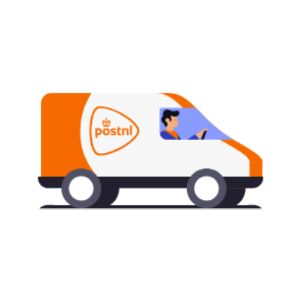

# PostNL

Your PostNL account in Homey: announced mail (My Post) with scans, all your parcels (My Packages) with the official Track & Trace status, delivery window, weight, dimensions and full status history, plus the **My Delivery** image for your Flows and dashboard.

## At a glance

| | |
|---|---|
| Countries | 🇳🇱 Netherlands (PostNL account from jouw.postnl.nl) |
| Connect with | Account |
| Device ID | `postnl` |
| Flow cards | 12 triggers · 7 conditions · 1 action |

## Connect

1. Open Homey → **Devices** → **+** → **MyParcel** → **PostNL**.
2. Enter the e-mail address and password you use on **jouw.postnl.nl** and tap **Connect**.
3. Your password is only used to sign in to PostNL; Homey then stores the resulting tokens, not your password.
4. Login expired later on? Use **Repair** on the device and sign in again.

## Device values (capabilities)

Every value appears on the device in Homey. Not every field is filled for every parcel.

| ID | Type | Nederlands | English |
|---|---|---|---|
| `postnl_mail_expected` | yes/no | Post verwacht | Mail expected |
| `postnl_mail_count` | number | Poststukken | Mail items |
| `postnl_package_count` | number | Pakketten onderweg | Parcels underway |
| `postnl_next_delivery` | text | Volgende bezorging | Next delivery |
| `postnl_delivery_date` | text | Bezorgdatum | Delivery date |
| `postnl_delivery_window` | text | Bezorgvenster | Delivery window |
| `postnl_package_status` | text | Pakketstatus | Parcel status |
| `postnl_package_sender` | text | Afzender pakket | Parcel sender |
| `postnl_package_receiver` | text | Ontvanger pakket | Parcel receiver |
| `postnl_package_tracking` | text | Trackingnummer | Tracking number |
| `postnl_package_event` | text | Laatste pakketgebeurtenis | Latest parcel event |
| `postnl_package_status_time` | text | Tijdstip pakketstatus | Parcel status time |
| `postnl_package_delivered` | yes/no | Pakket bezorgd | Parcel delivered |
| `postnl_package_shipment_type` | text | Type zending | Shipment type |
| `postnl_package_weight` | text | Gewicht pakket | Parcel weight |
| `postnl_package_weight_kg` | number | Gewicht pakket (kg) | Parcel weight (kg) |
| `postnl_package_length` | number | Lengte pakket | Parcel length |
| `postnl_package_width` | number | Breedte pakket | Parcel width |
| `postnl_package_height` | number | Hoogte pakket | Parcel height |
| `postnl_package_status_history` | text | Volledige statusgeschiedenis | Full status history |
| `postnl_package_observation_code` | text | ObservationCode | Observation code |
| `postnl_package_canonical_status` | text | Canonieke status | Canonical status |
| `postnl_package_pickup` | yes/no | Bezorging bij PostNL-punt | PostNL Point delivery |
| `postnl_package_pickup_point` | text | PostNL-punt | PostNL Point |
| `postnl_package_dimensions` | text | Afmetingen pakket | Parcel dimensions |
| `postnl_status` | text | Verbindingsstatus | Connection status |
| `postnl_last_update` | text | Laatste update | Last update |

## Flow cards

### When… (triggers)

| ID | Nederlands | English |
|---|---|---|
| `new_mail` | Er is nieuwe post onderweg | New mail is expected |
| `new_package` | Er is een nieuw pakket gevonden | A new parcel was found |
| `delivery_window_known` | Er is een bezorgvenster bekend | A delivery window became available |
| `package_status_changed` | De status van een pakket is gewijzigd | A parcel status changed |
| `sync_failed` | PostNL-synchronisatie is mislukt | PostNL synchronization failed |
| `login_expired` | De PostNL-aanmelding is verlopen | The PostNL login expired |
| `package_delivered` | Een pakket is bezorgd | A parcel was delivered |
| `delivery_window_changed` | Het bezorgvenster van een pakket is gewijzigd | A parcel delivery window changed |
| `package_event_changed` | Er is een nieuwe PostNL-pakketgebeurtenis | A new PostNL parcel event was received |
| `package_weight_known` | Het gewicht van een pakket is bekend | Parcel weight became available |
| `package_dimensions_known` | De afmetingen van een pakket zijn bekend | Parcel dimensions became available |
| `connection_status_changed` | Verbindingsstatus is gewijzigd | Connection status changed *(applies to all MyParcel devices)* |

### And… (conditions)

| ID | Nederlands | English | Arguments |
|---|---|---|---|
| `mail_expected` | Post wordt/wordt niet verwacht | Mail is/isn't expected | — |
| `packages_underway` | Er zijn/zijn geen pakketten onderweg | Parcels are/aren't underway | — |
| `delivery_window_known` | Er is/is geen bezorgvenster bekend | A delivery window is/isn't known | — |
| `postnl_connected` | PostNL is/is niet verbonden | PostNL is/isn't connected | — |
| `package_has_weight` | Het huidige pakket heeft/heeft geen gewichtsinformatie | The current parcel has/doesn't have weight information | — |
| `package_has_dimensions` | Het huidige pakket heeft/heeft geen afmetingen | The current parcel has/doesn't have dimensions | — |
| `package_status_is` | De huidige pakketstatus is/is niet | The current parcel status is/isn't | Status |

### Then… (actions)

| ID | Nederlands | English | Arguments |
|---|---|---|---|
| `sync_now` | Synchroniseer PostNL | Synchronize PostNL | — |

## Notable tokens

Tokens passed by this carrier's When cards (not every card has every token).

Show all 50 tokens

| Token | Type | Nederlands | English |
|---|---|---|---|
| `count` | number | Aantal poststukken | Number of mail items |
| `id` | text | Poststuk-ID | Mail item ID |
| `title` | text | Poststuk | Mail item |
| `sender` | text | Afzender (indien beschikbaar) | Sender (if available) |
| `date` | text | Bezorgdatum | Delivery date |
| `unread` | yes/no | Ongelezen | Unread |
| `image_available` | yes/no | Afbeelding beschikbaar | Image available |
| `image` | image | Afbeelding poststuk | Mail item image |
| `receiver` | text | Ontvanger | Receiver |
| `barcode` | text | Barcode | Barcode |
| `status` | text | Status | Status |
| `status_raw` | text | Officiële PostNL-status | Official PostNL status |
| `status_code` | text | Officiële PostNL-statuscode | Official PostNL status code |
| `status_event` | text | Laatste PostNL-gebeurtenis | Latest PostNL event |
| `status_event_time` | text | Laatste statusupdate | Latest status update |
| `delivery_date` | text | Bezorgdatum | Delivery date |
| `delivery_window` | text | Bezorgvenster | Delivery window |
| `delivery_window_from` | text | Bezorgvenster vanaf | Delivery window from |
| `delivery_window_to` | text | Bezorgvenster tot | Delivery window to |
| `delivery_window_type` | text | Type bezorgvenster | Delivery window type |
| `details_url` | text | Tracking-URL | Tracking URL |
| `shipment_type` | text | Zendingstype | Shipment type |
| `delivery_address_type` | text | Type bezorgadres | Delivery address type |
| `direction` | text | Richting | Direction |
| `created_at` | text | Aangemaakt op | Created at |
| `delivered` | yes/no | Bezorgd | Delivered |
| `shared_from` | text | Gedeeld via | Shared from |
| `source_account_id` | text | Bronaccount-ID | Source account ID |
| `package_status_text` | text | Pakketstatus | Package status |
| `package_window_text` | text | Tekst bezorgvenster | Delivery window text |
| `package_delivery_date` | text | Bezorgdatum pakket | Package delivery date |
| `package_sender` | text | Afzender pakket | Package sender |
| `package_tracking` | text | Trackingnummer pakket | Package tracking number |
| `package_image_available` | yes/no | Afbeelding Mijn Bezorging beschikbaar | My delivery image available |
| `package_image` | image | Afbeelding Mijn Bezorging | My delivery image |
| `weight` | text | Gewicht | Weight |
| `dimensions` | text | Afmetingen | Dimensions |
| `weight_kg` | number | Gewicht pakket (kg) | Parcel weight (kg) |
| `dimension_length` | number | Lengte pakket (cm) | Parcel length (cm) |
| `dimension_width` | number | Breedte pakket (cm) | Parcel width (cm) |
| `dimension_height` | number | Hoogte pakket (cm) | Parcel height (cm) |
| `status_history` | text | Volledige statusgeschiedenis | Full status history |
| `observation_code` | text | PostNL-observatiecode | PostNL observation code |
| `canonical_status` | text | Canonieke pakketstatus | Canonical parcel status |
| `pickup` | yes/no | Bezorging bij PostNL-punt | PostNL Point delivery |
| `pickup_point` | text | PostNL-punt | PostNL Point |
| `old_status` | text | Vorige status | Previous status |
| `error` | text | Foutmelding | Error |
| `old_delivery_window` | text | Vorig bezorgvenster | Previous delivery window |
| `old_event` | text | Vorige PostNL-gebeurtenis | Previous PostNL event |

## Limitations and tips

* **Flow image:** parcel cards (also the delivery-window cards) pass the **My Delivery** camera image, pinned to exactly that parcel and status right before the trigger. Delivered parcels get no new drawing and keep the current My Delivery image, so the token is never empty.
* **Global image tokens:** **Parcel image** and **Latest mail scan** work in every Flow, whichever card started it. They appear as *&lt;device name&gt; · Parcel image* and *&lt;device name&gt; · Latest mail scan*.
* Track & Trace is only fetched for active parcels (max. 3 at a time); only the 15 most recent delivered parcels are kept.
* My Post is live-only: mail you remove in the PostNL app also disappears from Homey after the next refresh. Scans are not stored locally.

[← All carriers](README.md) · [Flow cards](../flows.md) · [Flow tokens](../tokens.md) · [Troubleshooting](../troubleshooting.md) · [Homey App Store](https://homey.app/en-us/app/nl.lrvdlinden.MyParcel/MyParcel/test/) · [Homey Community](https://community.homey.app/t/app-pro-myparcel/159800)
