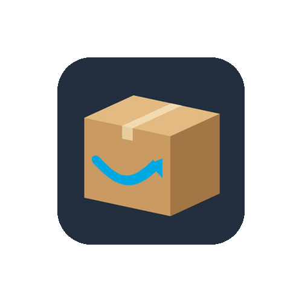

# Amazon

> **Nieuw in v0.3.6** · **Experimenteel**

**Experimenteel.** Log in op de eigen pagina van Amazon om de zendingen van je bestellingen te zien, met artikel, bezorgende vervoerder, verwachte bezorgdatum, onderweg, klaar om op te halen en bezorgd.

## In één oogopslag

| | |
|---|---|
| Landen | 🇳🇱 🇧🇪 🇩🇪 🇫🇷 🇬🇧 🇮🇪 🇪🇸 🇮🇹 🇸🇪 🇵🇱 🇺🇸 🇨🇦 🇲🇽 🇧🇷 🇦🇺 🇯🇵 🇮🇳 17 Amazon-winkels: Nederland, België, Duitsland, Frankrijk, Verenigd Koninkrijk, Ierland, Spanje, Italië, Zweden, Polen, Verenigde Staten, Canada, Mexico, Brazilië, Australië, Japan en India |
| Koppelen met | Account |
| Apparaat-ID | `amazon` |
| Flow-kaarten | 9 triggers · 6 condities · 2 acties |

## Koppelen

1. Open Homey → **Apparaten** → **+** → **MyParcel** → **Amazon** en kies je **Amazon-winkel**.
2. Tik op **Amazon-login openen** en doorloop elke stap die Amazon vraagt (wachtwoord, verificatiecode, puzzel of passkey). Wachtwoord, code en puzzel blijven bij Amazon.
3. Je komt uit op een pagina die leeg kan lijken of een fout toont – dat hoort zo. Kopieer het volledige adres uit de adresbalk, plak het in **Adres na het inloggen** en tik op **Account koppelen**.
4. Homey bewaart alleen een inlogtoken. Toegang intrekken kan altijd via **Inhoud en apparaten beheren** bij Amazon.

## Instellingen

| Groep | Instelling | Uitleg |
|---|---|---|
| Amazon | **Amazon-winkel** | De Amazon-website waarop je bestelt. Gebruik na een wijziging Repareren als Amazon opnieuw om inloggen vraagt. (keuzes: Nederland, België, Duitsland, Frankrijk, Verenigd Koninkrijk, Ierland, Spanje, Italië, Zweden, Polen, Verenigde Staten, Canada, Mexico, Brazilië, Australië, Japan, India) |
| Amazon | **Bezorgde pakketten tonen gedurende (dagen)** | (standaard: 7) |

## Apparaatwaarden (capabilities)

Elke waarde verschijnt op het apparaat in Homey. Niet elk veld is voor elk pakket gevuld.

| ID | Type | Nederlands | English |
|---|---|---|---|
| `amazon_parcel_count` | getal | Actieve pakketten | Active parcels |
| `amazon_status` | tekst | Status | Status |
| `amazon_tracking` | tekst | Trackingnummer | Tracking number |
| `amazon_item` | tekst | Artikel | Item |
| `amazon_carrier` | tekst | Bezorgdienst | Delivery carrier |
| `amazon_delivery_date` | tekst | Bezorgdatum | Delivery date |
| `amazon_next_delivery` | tekst | Volgende bezorging | Next delivery |
| `amazon_out_for_delivery_count` | getal | Onderweg voor bezorging | Out for delivery |
| `amazon_pickup_count` | getal | Klaar om op te halen | Ready for pickup |
| `amazon_delivered_count` | getal | Recent bezorgd | Recently delivered |
| `amazon_last_event` | tekst | Laatste gebeurtenis | Last event |
| `myparcel_connection_status` | tekst | Verbindingsstatus | Connection status |
| `amazon_last_update` | tekst | Laatste update | Last update |

## Flow-kaarten

### Wanneer… (triggers)

| ID | Nederlands | English |
|---|---|---|
| `amazon_new_package` | Nieuw Amazon-pakket | New Amazon parcel |
| `amazon_status_changed` | Status Amazon-pakket gewijzigd | Amazon parcel status changed |
| `amazon_package_event_changed` | Nieuwe Amazon-trackinggebeurtenis | New Amazon tracking event |
| `amazon_out_for_delivery` | Amazon-pakket onderweg voor bezorging | Amazon parcel out for delivery |
| `amazon_ready_for_pickup` | Amazon-pakket klaar om op te halen | Amazon parcel ready for pickup |
| `amazon_delivered` | Amazon-pakket bezorgd | Amazon parcel delivered |
| `amazon_package_problem` | Probleem of retour bij Amazon-pakket | Amazon parcel has a problem or is returning |
| `amazon_delivery_window_changed` | Verwachte Amazon-bezorgdatum gewijzigd | Amazon expected delivery date changed |
| `connection_status_changed` | Verbindingsstatus is gewijzigd *(geldt voor alle MyParcel-apparaten)* | Connection status changed |

### En… (condities)

| ID | Nederlands | English | Argumenten |
|---|---|---|---|
| `amazon_packages_underway` | Er zijn/zijn geen Amazon-pakketten onderweg | Amazon parcels are/are not underway | — |
| `amazon_out_for_delivery_now` | Er is een/geen Amazon-pakket onderweg voor bezorging | A Amazon parcel is/is not out for delivery | — |
| `amazon_ready_for_pickup_now` | Er ligt een/geen Amazon-pakket klaar om op te halen | A Amazon parcel is/is not ready for pickup | — |
| `amazon_any_status_is` | Een Amazon-pakket heeft/heeft niet status… | A Amazon parcel has/does not have status… | Status (Aangemeld, Onderweg, Onderweg voor bezorging, Klaar om op te halen, Bezorgd, Retour naar afzender, Probleem, Nog niet bekend bij Amazon) |
| `amazon_parcel_is_delivered` | Amazon-pakket… is/is niet bezorgd | Amazon parcel… is/is not delivered | Trackingnummer |
| `amazon_is_tracking` | Amazon-pakket… wordt wel/niet gevolgd | Amazon parcel… is/is not being tracked | Trackingnummer |

### Dan… (acties)

| ID | Nederlands | English | Argumenten |
|---|---|---|---|
| `amazon_refresh` | Vernieuw Amazon | Refresh Amazon | — |
| `amazon_remove_delivered` | Verwijder bezorgde Amazon-pakketten | Remove delivered Amazon parcels | — |

## Belangrijke tokens

Tokens die de Wanneer-kaarten van deze vervoerder meegeven (niet elke kaart heeft elk token).

Toon alle 24 tokens

| Token | Type | Nederlands | English |
|---|---|---|---|
| `tracking` | tekst | Trackingnummer | Tracking number |
| `status` | tekst | Status | Status |
| `status_code` | tekst | Statuscode | Status code |
| `raw_status` | tekst | Amazon-statustekst | Amazon status text |
| `sender` | tekst | Afzender | Sender |
| `receiver` | tekst | Ontvanger | Recipient |
| `delivery_date` | tekst | Bezorgdatum | Delivery date |
| `delivery_window` | tekst | Bezorgvenster | Delivery window |
| `window_start` | tekst | Begin venster | Window start |
| `window_end` | tekst | Einde venster | Window end |
| `pickup_point` | tekst | Afhaalpunt | Pickup point |
| `last_event` | tekst | Laatste gebeurtenis | Last event |
| `last_event_time` | tekst | Tijd laatste gebeurtenis | Last event time |
| `delivered_at` | tekst | Bezorgd op | Delivered at |
| `direction` | tekst | Richting | Direction |
| `history` | tekst | Statusgeschiedenis | Status history |
| `url` | tekst | Trackinglink | Tracking link |
| `item` | tekst | Artikel | Item |
| `delivery_carrier` | tekst | Bezorgdienst | Delivery carrier |
| `order_id` | tekst | Bestelnummer | Order number |
| `previous_status` | tekst | Vorige status | Previous status |
| `old_status_code` | tekst | Vorige statuscode | Previous status code |
| `old_event` | tekst | Vorige Amazon-statustekst | Previous Amazon status text |
| `old_delivery_window` | tekst | Vorig bezorgvenster | Previous delivery window |

## Beperkingen en tips

* **Experimenteel:** Amazon kan zijn pagina's op elk moment wijzigen; gegevens kunnen dan tijdelijk ontbreken.
* **Maximaal 10 zendingen per pollronde** worden gelezen; bezorgde zendingen worden maar één keer gelezen.
* Elke inloglink werkt maar één keer. Andere winkel gekozen of vraagt Amazon opnieuw om in te loggen? Gebruik **Herstellen**.
* Geen bezorgvenster: Amazon geeft alleen een verwachte bezorgdatum. De kaart *verwachte bezorgdatum gewijzigd* gaat af als die datum verandert.

[← Alle vervoerders](README.md) · [Flow-kaarten](../flows.md) · [Flow-tokens](../tokens.md) · [Problemen oplossen](../troubleshooting.md) · [Homey App Store](https://homey.app/en-us/app/nl.lrvdlinden.MyParcel/MyParcel/test/) · [Homey Community](https://community.homey.app/t/app-pro-myparcel/159800)
