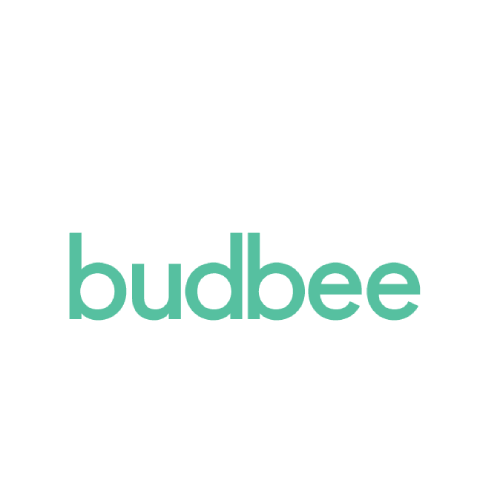

# Budbee

Budbee-thuisbezorgingen en Budbee Boxes. Een pakket dat *in de Box is afgeleverd* is klaar om op te halen, *opgehaald* betekent bezorgd. Met ETA als bezorgvenster, ophaaldeadline, retouren/verzonden pakketten en gebeurtenisteksten in je eigen taal.

## In één oogopslag

| | |
|---|---|
| Landen | 🇳🇱 🇧🇪 🇸🇪 🇩🇰 🇫🇮 Nederland, België en de andere Budbee-landen (tracking via Budbee) |
| Koppelen met | Trackingnummer |
| Apparaat-ID | `budbee` |
| Flow-kaarten | 11 triggers · 8 condities · 4 acties |

## Koppelen

1. Open Homey → **Apparaten** → **+** → **MyParcel** → **Budbee**.
2. Vul je **tracking-/bestelnummers** in (één per regel, uit de winkelmail of de Budbee-link). Er is geen account nodig.
3. Tik op **Budbee-apparaat toevoegen**. Nummers toevoegen kan later via de apparaatinstellingen of met een Flow.

## Instellingen

| Groep | Instelling | Uitleg |
|---|---|---|
| Budbee Track & Trace | **Trackingnummers** | Eén Budbee-trackingcode per regel (uit de mail van de winkel of de Budbee-link). |
| Budbee Track & Trace | **Bezorgde pakketten tonen gedurende (dagen)** | (standaard: 7) |

## Apparaatwaarden (capabilities)

Elke waarde verschijnt op het apparaat in Homey. Niet elk veld is voor elk pakket gevuld.

| ID | Type | Nederlands | English |
|---|---|---|---|
| `budbee_parcel_count` | getal | Actieve pakketten | Active parcels |
| `budbee_status` | tekst | Status | Status |
| `budbee_tracking` | tekst | Trackingnummer | Tracking number |
| `budbee_sender` | tekst | Afzender | Sender |
| `budbee_delivery_date` | tekst | Bezorgdatum | Delivery date |
| `budbee_delivery_window` | tekst | Bezorgvenster | Delivery window |
| `budbee_next_delivery` | tekst | Volgende bezorging | Next delivery |
| `budbee_out_for_delivery_count` | getal | Onderweg voor bezorging | Out for delivery |
| `budbee_en_route_pickup_count` | getal | Onderweg naar afhaalpunt | En route to pickup point |
| `budbee_pickup_count` | getal | Klaar om op te halen | Ready for pickup |
| `budbee_pickup_point` | tekst | Afhaalpunt | Pickup point |
| `budbee_delivered_count` | getal | Recent bezorgd | Recently delivered |
| `budbee_outgoing_count` | getal | Verzonden pakketten onderweg | Sent parcels underway |
| `budbee_last_event` | tekst | Laatste gebeurtenis | Last event |
| `myparcel_connection_status` | tekst | Verbindingsstatus | Connection status |
| `budbee_last_update` | tekst | Laatste update | Last update |

## Flow-kaarten

### Wanneer… (triggers)

| ID | Nederlands | English |
|---|---|---|
| `budbee_new_package` | Nieuw Budbee-pakket | New Budbee package |
| `budbee_status_changed` | Budbee-pakketstatus gewijzigd | Budbee package status changed |
| `budbee_package_event_changed` | Nieuwe Budbee-trackinggebeurtenis | New Budbee tracking event |
| `budbee_out_for_delivery` | Budbee-pakket onderweg voor bezorging | Budbee parcel out for delivery |
| `budbee_ready_for_pickup` | Budbee-pakket klaar om op te halen | Budbee parcel ready for pickup |
| `budbee_delivered` | Budbee-pakket bezorgd | Budbee parcel delivered |
| `budbee_package_problem` | Probleem of retour bij Budbee-pakket | Budbee parcel has a problem or is returning |
| `budbee_outgoing_status_changed` | Status van verzonden Budbee-pakket gewijzigd | Status of sent Budbee parcel changed |
| `budbee_outgoing_delivered` | Verzonden Budbee-pakket bezorgd | Sent Budbee parcel delivered |
| `budbee_delivery_window_changed` | Bezorgvenster bekend of gewijzigd | Delivery window available or changed |
| `connection_status_changed` | Verbindingsstatus is gewijzigd *(geldt voor alle MyParcel-apparaten)* | Connection status changed |

### En… (condities)

| ID | Nederlands | English | Argumenten |
|---|---|---|---|
| `budbee_packages_underway` | Er zijn Budbee-pakketten onderweg | Budbee packages are underway | — |
| `budbee_delivery_window_known` | Bezorgvenster is/is niet bekend | Delivery window is/isn't known | — |
| `budbee_out_for_delivery_now` | Er is een/geen Budbee-pakket onderweg voor bezorging | A Budbee parcel is/is not out for delivery | — |
| `budbee_ready_for_pickup_now` | Er ligt een/geen Budbee-pakket klaar om op te halen | A Budbee parcel is/is not ready for pickup | — |
| `budbee_any_status_is` | Een Budbee-pakket heeft/heeft niet status… | A Budbee parcel has/does not have status… | Status (Aangemeld, Onderweg, Onderweg voor bezorging, Klaar om op te halen, Bezorgd, Retour naar afzender, Probleem, Nog niet bekend bij Budbee) |
| `budbee_parcel_is_delivered` | Budbee-pakket… is/is niet bezorgd | Budbee parcel… is/is not delivered | Trackingnummer |
| `budbee_is_tracking` | Budbee-pakket… wordt wel/niet gevolgd | Budbee parcel… is/is not being tracked | Trackingnummer |
| `budbee_outgoing_underway` | Er zijn/zijn geen verzonden Budbee-pakketten onderweg | Sent Budbee parcels are/are not underway | — |

### Dan… (acties)

| ID | Nederlands | English | Argumenten |
|---|---|---|---|
| `budbee_refresh` | Vernieuw Budbee | Refresh Budbee | — |
| `budbee_track_parcel` | Volg Budbee-pakket… | Track Budbee parcel… | Trackingnummer |
| `budbee_untrack_parcel` | Stop met volgen van Budbee-pakket… | Stop tracking Budbee parcel… | Trackingnummer |
| `budbee_remove_delivered` | Verwijder bezorgde Budbee-pakketten | Remove delivered Budbee parcels | — |

## Belangrijke tokens

Tokens die de Wanneer-kaarten van deze vervoerder meegeven (niet elke kaart heeft elk token).

Toon alle 22 tokens

| Token | Type | Nederlands | English |
|---|---|---|---|
| `tracking` | tekst | Trackingnummer | Tracking number |
| `status` | tekst | Status | Status |
| `status_code` | tekst | Statuscode | Status code |
| `raw_status` | tekst | Budbee-statustekst | Budbee status text |
| `sender` | tekst | Afzender | Sender |
| `receiver` | tekst | Ontvanger | Recipient |
| `delivery_date` | tekst | Bezorgdatum | Delivery date |
| `delivery_window` | tekst | Bezorgvenster | Delivery window |
| `window_start` | tekst | Begin venster | Window start |
| `window_end` | tekst | Einde venster | Window end |
| `pickup_point` | tekst | Afhaalpunt | Pickup point |
| `last_event` | tekst | Laatste gebeurtenis | Last event |
| `last_event_time` | tekst | Tijd laatste gebeurtenis | Last event time |
| `delivered_at` | tekst | Bezorgd op | Delivered at |
| `direction` | tekst | Richting | Direction |
| `history` | tekst | Statusgeschiedenis | Status history |
| `url` | tekst | Trackinglink | Tracking link |
| `pickup_deadline` | tekst | Ophalen vóór | Pick up before |
| `previous_status` | tekst | Vorige status | Previous status |
| `old_status_code` | tekst | Vorige statuscode | Previous status code |
| `old_event` | tekst | Vorige Budbee-statustekst | Previous Budbee status text |
| `carrier` | tekst | Vervoerder | Carrier |

## Beperkingen en tips

* Budbee heeft geen account-koppeling: alleen nummers die je toevoegt worden gevolgd.

[← Alle vervoerders](README.md) · [Flow-kaarten](../flows.md) · [Flow-tokens](../tokens.md) · [Problemen oplossen](../troubleshooting.md) · [Homey App Store](https://homey.app/en-us/app/nl.lrvdlinden.MyParcel/MyParcel/test/) · [Homey Community](https://community.homey.app/t/app-pro-myparcel/159800)
