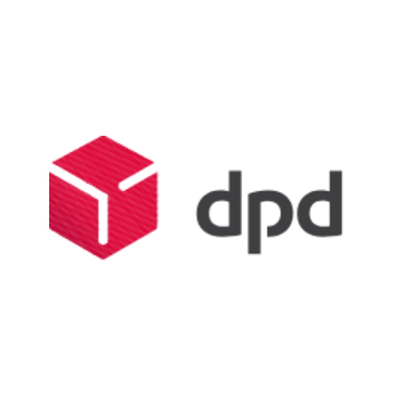

# DPD

**Gebied:** 🇪🇺 Europe

**Beschrijving:** myDPD zendingen

## Installeren en koppelen

Open Homey → Apparaten → Toevoegen → MyParcel, selecteer je vervoerder en volg het aanmeldscherm. Maak voor elke vervoerder die je gebruikt een afzonderlijk apparaat aan.

## Apparaatwaarden

* `dpd_parcel_count`
* `dpd_total_count`
* `dpd_status`
* `dpd_tracking`
* `dpd_sender`
* `dpd_receiver`
* `dpd_delivery_date`
* `dpd_delivery_window`
* `dpd_delivery_point`
* `dpd_weight`
* `dpd_dimensions`
* `dpd_delivery_type`
* `dpd_last_event`
* `dpd_direction`
* `myparcel_connection_status`
* `dpd_last_update`

De beschikbaarheid van gegevens verschilt per vervoerder en pakket. Niet alle velden zijn altijd gevuld.

[← Ondersteunde vervoerders](README.md) · [Homey App Store](https://homey.app/en-us/app/nl.lrvdlinden.MyParcel/MyParcel/test/) · [Homey Community](https://community.homey.app/t/app-pro-myparcel/159800)
