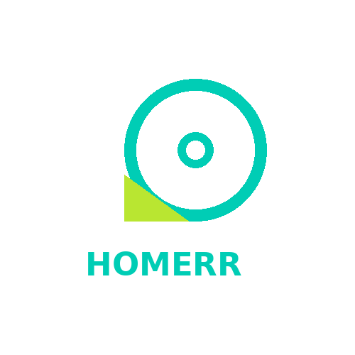

# Vinted Go

Vinted Go (voorheen Homerr): je pakketten per account, ook verzonden pakketten, met afhaalpunt, **ophaalcode** en artikelnaam.

## In één oogopslag

| | |
|---|---|
| Landen | 🇳🇱 🇧🇪 🇫🇷 🇪🇸 Nederland, België, Frankrijk en de andere Vinted Go-landen |
| Koppelen met | Account |
| Apparaat-ID | `homerr` |
| Flow-kaarten | 10 triggers · 6 condities · 2 acties |

## Koppelen

1. Open Homey → **Apparaten** → **+** → **MyParcel** → **Vinted Go**.
2. Vul het e-mailadres in dat aan je Vinted Go-zendingen is gekoppeld en tik op **Verificatielink versturen**.
3. Open de verificatiemail en plak de **volledige link of het token** in het scherm.
4. Tik op **Account koppelen**. MyParcel bewaart een roterend logintoken, geen wachtwoord.

## Instellingen

| Groep | Instelling | Uitleg |
|---|---|---|
| Vinted Go | **E-mailadres** | — |
| Vinted Go | **Bezorgde pakketten tonen gedurende (dagen)** | (standaard: 7) |

## Apparaatwaarden (capabilities)

Elke waarde verschijnt op het apparaat in Homey. Niet elk veld is voor elk pakket gevuld.

| ID | Type | Nederlands | English |
|---|---|---|---|
| `homerr_parcel_count` | getal | Pakketten onderweg | Packages underway |
| `homerr_status` | tekst | Status | Status |
| `homerr_tracking` | tekst | Trackingnummer | Tracking number |
| `homerr_item` | tekst | Artikel | Item |
| `homerr_pickup_count` | getal | Klaar om op te halen | Ready for pickup |
| `homerr_en_route_pickup_count` | getal | Onderweg naar afhaalpunt | En route to pickup point |
| `homerr_pickup_point` | tekst | Afhaalpunt | Pickup point |
| `homerr_pickup_code` | tekst | Ophaalcode | Pickup code |
| `homerr_delivered_count` | getal | Recent bezorgd | Recently delivered |
| `homerr_outgoing_count` | getal | Verzonden pakketten onderweg | Sent parcels underway |
| `homerr_last_event` | tekst | Laatste gebeurtenis | Last event |
| `myparcel_connection_status` | tekst | Verbindingsstatus | Connection status |
| `homerr_last_update` | tekst | Laatste update | Last update |

## Flow-kaarten

### Wanneer… (triggers)

| ID | Nederlands | English |
|---|---|---|
| `homerr_new_package` | Nieuw Vinted Go-pakket | New Vinted Go parcel |
| `homerr_package_status_changed` | Vinted Go-pakketstatus gewijzigd | Vinted Go package status changed |
| `homerr_package_event_changed` | Nieuwe Vinted Go-trackinggebeurtenis | New Vinted Go tracking event |
| `homerr_out_for_delivery` | Vinted Go-pakket onderweg voor bezorging | Vinted Go parcel out for delivery |
| `homerr_ready_for_pickup` | Vinted Go-pakket klaar om op te halen | Vinted Go parcel ready for pickup |
| `homerr_delivered` | Vinted Go-pakket bezorgd | Vinted Go parcel delivered |
| `homerr_package_problem` | Probleem of retour bij Vinted Go-pakket | Vinted Go parcel has a problem or is returning |
| `homerr_outgoing_status_changed` | Status van verzonden Vinted Go-pakket gewijzigd | Status of sent Vinted Go parcel changed |
| `homerr_outgoing_delivered` | Verzonden Vinted Go-pakket bezorgd | Sent Vinted Go parcel delivered |
| `connection_status_changed` | Verbindingsstatus is gewijzigd *(geldt voor alle MyParcel-apparaten)* | Connection status changed |

### En… (condities)

| ID | Nederlands | English | Argumenten |
|---|---|---|---|
| `homerr_packages_underway` | Er zijn Vinted Go-pakketten onderweg | Vinted Go packages are underway | — |
| `homerr_out_for_delivery_now` | Er is een/geen Vinted Go-pakket onderweg voor bezorging | A Vinted Go parcel is/is not out for delivery | — |
| `homerr_ready_for_pickup_now` | Er ligt een/geen Vinted Go-pakket klaar om op te halen | A Vinted Go parcel is/is not ready for pickup | — |
| `homerr_any_status_is` | Een Vinted Go-pakket heeft/heeft niet status… | A Vinted Go parcel has/does not have status… | Status (Aangemeld, Onderweg, Onderweg voor bezorging, Klaar om op te halen, Bezorgd, Retour naar afzender, Probleem, Nog niet bekend bij Vinted Go) |
| `homerr_parcel_is_delivered` | Vinted Go-pakket… is/is niet bezorgd | Vinted Go parcel… is/is not delivered | Trackingnummer |
| `homerr_outgoing_underway` | Er zijn/zijn geen verzonden Vinted Go-pakketten onderweg | Sent Vinted Go parcels are/are not underway | — |

### Dan… (acties)

| ID | Nederlands | English | Argumenten |
|---|---|---|---|
| `homerr_refresh` | Vernieuw Vinted Go-pakketten | Refresh Vinted Go packages | — |
| `homerr_remove_delivered` | Verwijder bezorgde Vinted Go-pakketten | Remove delivered Vinted Go parcels | — |

## Belangrijke tokens

Tokens die de Wanneer-kaarten van deze vervoerder meegeven (niet elke kaart heeft elk token).

Toon alle 23 tokens

| Token | Type | Nederlands | English |
|---|---|---|---|
| `tracking` | tekst | Trackingnummer | Tracking number |
| `status` | tekst | Status | Status |
| `status_code` | tekst | Statuscode | Status code |
| `raw_status` | tekst | Vinted Go-statustekst | Vinted Go status text |
| `sender` | tekst | Afzender | Sender |
| `receiver` | tekst | Ontvanger | Recipient |
| `delivery_date` | tekst | Bezorgdatum | Delivery date |
| `delivery_window` | tekst | Bezorgvenster | Delivery window |
| `window_start` | tekst | Begin venster | Window start |
| `window_end` | tekst | Einde venster | Window end |
| `pickup_point` | tekst | Afhaalpunt | Pickup point |
| `last_event` | tekst | Laatste gebeurtenis | Last event |
| `last_event_time` | tekst | Tijd laatste gebeurtenis | Last event time |
| `delivered_at` | tekst | Bezorgd op | Delivered at |
| `direction` | tekst | Richting | Direction |
| `history` | tekst | Statusgeschiedenis | Status history |
| `url` | tekst | Trackinglink | Tracking link |
| `item` | tekst | Artikel | Item |
| `pickup_code` | tekst | Ophaalcode | Pickup code |
| `pickup_deadline` | tekst | Ophalen vóór | Pick up before |
| `previous_status` | tekst | Vorige status | Previous status |
| `old_status_code` | tekst | Vorige statuscode | Previous status code |
| `old_event` | tekst | Vorige Vinted Go-statustekst | Previous Vinted Go status text |

## Beperkingen en tips

* De tijdlijn van een pakket wordt alleen opgehaald als er iets verandert; afgesloten pakketten worden verborgen nadat ze zijn gemeld.

[← Alle vervoerders](README.md) · [Flow-kaarten](../flows.md) · [Flow-tokens](../tokens.md) · [Problemen oplossen](../troubleshooting.md) · [Homey App Store](https://homey.app/en-us/app/nl.lrvdlinden.MyParcel/MyParcel/test/) · [Homey Community](https://community.homey.app/t/app-pro-myparcel/159800)
