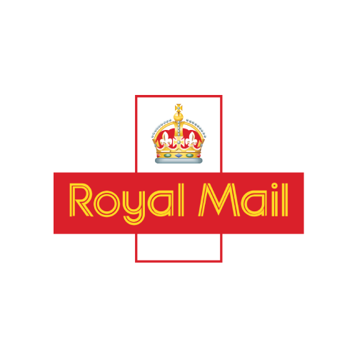

# Royal Mail

Royal Mail-bestellingen uit je **Click & Drop**-account (voor verzenders). MyParcel haalt recente bestellingen automatisch op; je vult geen trackingnummers in.

## In één oogopslag

| | |
|---|---|
| Landen | 🇬🇧 Verenigd Koninkrijk |
| Koppelen met | API-sleutel |
| Apparaat-ID | `royal-mail` |
| Flow-kaarten | 3 triggers · 1 conditie · 1 actie |

## Koppelen

1. Maak in Royal Mail Click & Drop een API-integratie aan via **Settings → Integrations → Click & Drop API** en kopieer de autorisatiesleutel.
2. Open Homey → **Apparaten** → **+** → **MyParcel** → **Royal Mail**.
3. Plak de **Click & Drop API-sleutel** en tik op **Royal Mail koppelen**.

## Instellingen

| Groep | Instelling | Uitleg |
|---|---|---|
| — | **Click & Drop API-sleutel** | (wordt verborgen opgeslagen) |
| — | **Orderhistorie (dagen)** | (standaard: 30) |

## Apparaatwaarden (capabilities)

Elke waarde verschijnt op het apparaat in Homey. Niet elk veld is voor elk pakket gevuld.

| ID | Type | Nederlands | English |
|---|---|---|---|
| `royal_mail_parcel_count` | getal | Actieve pakketten | Active parcels |
| `royal_mail_status` | tekst | Status | Status |
| `myparcel_connection_status` | tekst | Verbindingsstatus | Connection status |
| `royal_mail_last_update` | tekst | Laatste update | Last update |

## Flow-kaarten

### Wanneer… (triggers)

| ID | Nederlands | English |
|---|---|---|
| `royal_mail_new_package` | Nieuw Royal Mail-pakket | New Royal Mail package |
| `royal_mail_status_changed` | Royal Mail-pakketstatus gewijzigd | Royal Mail package status changed |
| `connection_status_changed` | Verbindingsstatus is gewijzigd *(geldt voor alle MyParcel-apparaten)* | Connection status changed |

### En… (condities)

| ID | Nederlands | English | Argumenten |
|---|---|---|---|
| `royal_mail_packages_underway` | Er zijn Royal Mail-pakketten onderweg | Royal Mail packages are underway | — |

### Dan… (acties)

| ID | Nederlands | English | Argumenten |
|---|---|---|---|
| `royal_mail_refresh` | Vernieuw Royal Mail | Refresh Royal Mail | — |

## Belangrijke tokens

Tokens die de Wanneer-kaarten van deze vervoerder meegeven (niet elke kaart heeft elk token).

Toon alle 3 tokens

| Token | Type | Nederlands | English |
|---|---|---|---|
| `tracking` | tekst | Trackingnummer | Tracking number |
| `status` | tekst | Status | Status |
| `previous_status` | tekst | Vorige status | Previous status |

## Beperkingen en tips

* Alleen voor Click & Drop-accounts (verzenders); inkomende Royal Mail-pakketten zonder Click & Drop worden niet ondersteund.
* Beperkte gegevens: aantal pakketten, status en laatste update.

[← Alle vervoerders](README.md) · [Flow-kaarten](../flows.md) · [Flow-tokens](../tokens.md) · [Problemen oplossen](../troubleshooting.md) · [Homey App Store](https://homey.app/en-us/app/nl.lrvdlinden.MyParcel/MyParcel/test/) · [Homey Community](https://community.homey.app/t/app-pro-myparcel/159800)
