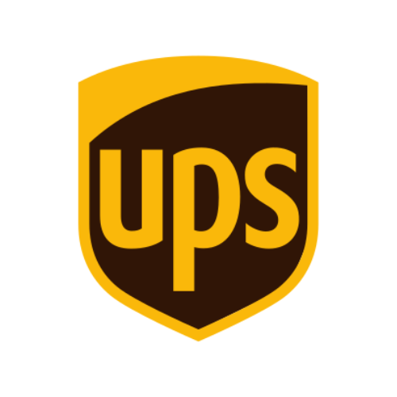

# UPS

UPS-zendingen in Homey via je UPS-account (UPS My Choice-dashboard), met service, verzend- en bezorgadres, Access Point, bezorgdatum en bezorgvenster. Als alternatief kun je losse trackingnummers volgen.

## In één oogopslag

| | |
|---|---|
| Landen | 🌍 Wereldwijd (land en UPS-taal instelbaar) |
| Koppelen met | Account · Trackingnummer |
| Apparaat-ID | `ups` |
| Flow-kaarten | 5 triggers · 3 condities · 1 actie |

## Koppelen

1. Open Homey → **Apparaten** → **+** → **MyParcel** → **UPS**.
2. Kies **land** en **taal**.
3. Log in bij UPS met de **UPS Token Helper**, open het UPS-dashboard, wacht tot de helper meldt dat de websessie klaar is en plak de `web_session`-koppelwaarde in **UPS-login-callback**. Tik op **UPS koppelen**.
4. **Handmatig alternatief:** vul trackingnummers in en tik op **Trackingnummers toevoegen**.

## Instellingen

| Groep | Instelling | Uitleg |
|---|---|---|
| — | **Landcode** | — |
| — | **UPS-locale** | — |
| — | **UPS-login-callback** | (wordt verborgen opgeslagen) |
| — | **UPS-autorisatiecode** | (wordt verborgen opgeslagen) |
| — | **UPS OAuth-state** | (wordt verborgen opgeslagen) |
| — | **UPS access-/sessietoken** | (wordt verborgen opgeslagen) |
| — | **UPS-refresh-token** | (wordt verborgen opgeslagen) |
| — | **Handmatige fallback-trackingnummers** | — |
| — | **UPS-websessie** | (wordt verborgen opgeslagen) |

## Apparaatwaarden (capabilities)

Elke waarde verschijnt op het apparaat in Homey. Niet elk veld is voor elk pakket gevuld.

| ID | Type | Nederlands | English |
|---|---|---|---|
| `ups_parcel_count` | getal | Actieve pakketten | Active parcels |
| `ups_total_count` | getal | Totaal pakketten | Total packages |
| `ups_status` | tekst | Status | Status |
| `ups_tracking` | tekst | Volgend trackingnummer | Next tracking number |
| `ups_sender` | tekst | Afzender | Sender |
| `ups_delivery_date` | tekst | Verwachte bezorging | Expected delivery |
| `ups_delivery_window` | tekst | Bezorgvenster | Delivery window |
| `ups_service` | tekst | UPS-service | UPS service |
| `ups_ship_from` | tekst | Verzonden vanaf | Ship from |
| `ups_ship_to` | tekst | Bestemming | Ship to |
| `ups_access_point` | tekst | UPS Access Point | UPS Access Point |
| `ups_last_event` | tekst | Laatste gebeurtenis | Last event |
| `ups_country` | tekst | UPS-land | UPS country |
| `ups_locale` | tekst | UPS-locale | UPS locale |
| `ups_account_status` | tekst | Verbindingsstatus | Connection status |
| `ups_last_update` | tekst | Laatste update | Last update |

## Flow-kaarten

### Wanneer… (triggers)

| ID | Nederlands | English |
|---|---|---|
| `ups_new_package` | Nieuw UPS-pakket | New UPS package |
| `ups_status_changed` | UPS-pakketstatus gewijzigd | UPS package status changed |
| `ups_delivered` | UPS-pakket bezorgd | UPS package delivered |
| `ups_delivery_window_changed` | Bezorgvenster bekend of gewijzigd | Delivery window available or changed |
| `connection_status_changed` | Verbindingsstatus is gewijzigd *(geldt voor alle MyParcel-apparaten)* | Connection status changed |

### En… (condities)

| ID | Nederlands | English | Argumenten |
|---|---|---|---|
| `ups_packages_underway` | Er zijn UPS-pakketten onderweg | UPS packages are underway | — |
| `ups_account_connected` | UPS-account is gekoppeld | UPS account is connected | — |
| `ups_delivery_window_known` | Bezorgvenster is/is niet bekend | Delivery window is/isn't known | — |

### Dan… (acties)

| ID | Nederlands | English | Argumenten |
|---|---|---|---|
| `ups_refresh` | Vernieuw UPS | Refresh UPS | — |

## Belangrijke tokens

Tokens die de Wanneer-kaarten van deze vervoerder meegeven (niet elke kaart heeft elk token).

Toon alle 14 tokens

| Token | Type | Nederlands | English |
|---|---|---|---|
| `tracking` | tekst | Trackingnummer | Tracking number |
| `status` | tekst | Status | Status |
| `sender` | tekst | Afzender | Sender |
| `delivery_date` | tekst | Verwachte bezorging | Expected delivery |
| `delivery_window` | tekst | Bezorgvenster | Delivery window |
| `service` | tekst | UPS-service | UPS service |
| `ship_from` | tekst | Verzonden vanaf | Ship from |
| `ship_to` | tekst | Bestemming | Ship to |
| `access_point` | tekst | UPS Access Point | UPS Access Point |
| `last_event` | tekst | Laatste gebeurtenis | Last event |
| `previous_status` | tekst | Vorige status | Previous status |
| `carrier` | tekst | Vervoerder | Carrier |
| `window_start` | tekst | Start bezorgvenster | Delivery window start |
| `window_end` | tekst | Einde bezorgvenster | Delivery window end |

## Beperkingen en tips

* UPS heeft (nog) minder Flow-kaarten dan de vernieuwde vervoerders: nieuw pakket, status gewijzigd, bezorgd en bezorgvenster.
* De UPS-websessie kan verlopen; gebruik dan **Herstellen** met een nieuwe helperwaarde.

[← Alle vervoerders](README.md) · [Flow-kaarten](../flows.md) · [Flow-tokens](../tokens.md) · [Problemen oplossen](../troubleshooting.md) · [Homey App Store](https://homey.app/en-us/app/nl.lrvdlinden.MyParcel/MyParcel/test/) · [Homey Community](https://community.homey.app/t/app-pro-myparcel/159800)
